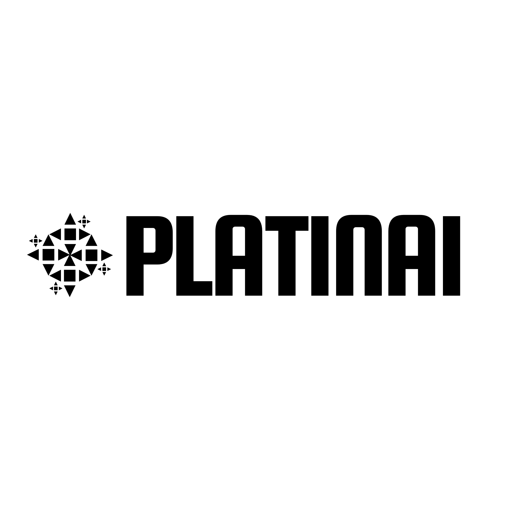
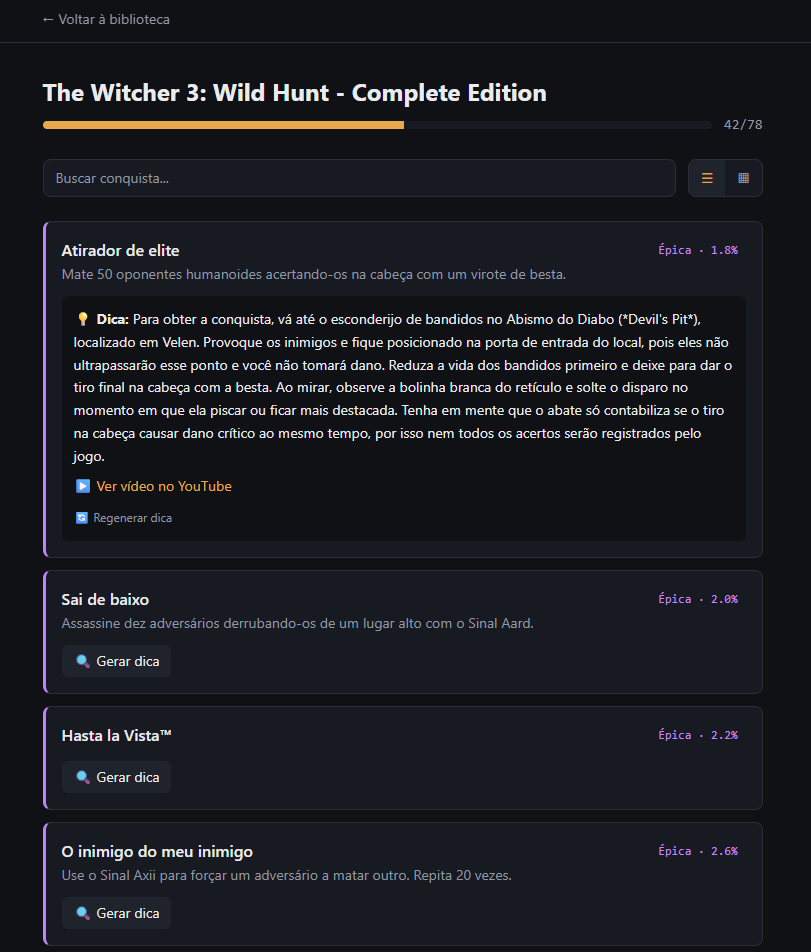

<p align="center">
  
</p>

<p align="center">
  <a href="https://steam-trophies.vercel.app"><strong>🔗 Testar agora</strong></a>
</p>

# Platinai

Um tracker de conquistas da Steam que vai além de mostrar o que falta — ele **ensina como conseguir**. Para cada conquista difícil, uma IA pesquisa a web em tempo real (guias, fóruns, vídeos) e gera um resumo prático de como desbloqueá-la.

*Platina + AI — o nome já entrega a proposta.*



## O que faz

- **Login com Steam** (OpenID) — sem senha, sem cadastro
- **Biblioteca completa** de jogos, com busca e visualização em grid ou lista
- Para cada jogo, lista de **conquistas ordenadas por raridade real** (% de jogadores que já desbloquearam, direto da API da Steam)
- **Guias gerados automaticamente por IA**: quando uma conquista não tem dica ainda, o app pesquisa na web (Tavily), sintetiza e traduz o resultado (Gemini), e anexa um vídeo do YouTube quando encontra um relevante
- Guias ficam salvos permanentemente — a IA nunca pesquisa a mesma conquista duas vezes
- Fallback inteligente de capa de jogo (Steam → fonte alternativa → nome em texto), para quando a arte oficial não está disponível

## Por que existe

Comecei jogando Assassin's Creed Black Flag e travei numa conquista sem conseguir achar uma dica clara. Trackers de conquista existentes (TrueAchievements, Exophase) mostram progresso, mas não ajudam a resolver o que está travado — e guias estáticos (PowerPyx) não sabem quais conquistas você especificamente já tem ou não. O Platinai junta as duas coisas.

## Stack

| Camada | Tecnologia |
|---|---|
| Framework | Next.js 16 (App Router, TypeScript) |
| Estilo | Tailwind CSS v4 |
| Autenticação | NextAuth v4 + Steam OpenID |
| Banco de dados | Supabase (Postgres) |
| Dados de jogos/conquistas | Steam Web API |
| Busca na web | Tavily API |
| Geração/tradução de texto | Google Gemini |
| Capa de jogo (fallback) | SteamGridDB |
| Hospedagem | Vercel |

## Rodando localmente

```bash
git clone https://github.com/MarquimSouza/steam-trophies.git
cd steam-trophies
npm install --legacy-peer-deps
```

Copie `.env.example` para `.env.local` e preencha suas próprias chaves (veja onde conseguir cada uma nos comentários do arquivo).

```bash
npm run dev
```

Abra [localhost:3000](http://localhost:3000).

## Status do projeto

Em desenvolvimento ativo, como projeto pessoal e peça de portfólio. Guias atualmente gerados sob demanda pela IA — cobertura expande conforme mais jogos são acessados pelo app.

---

Feito por [Marcos Silva](https://github.com/MarquimSouza).
